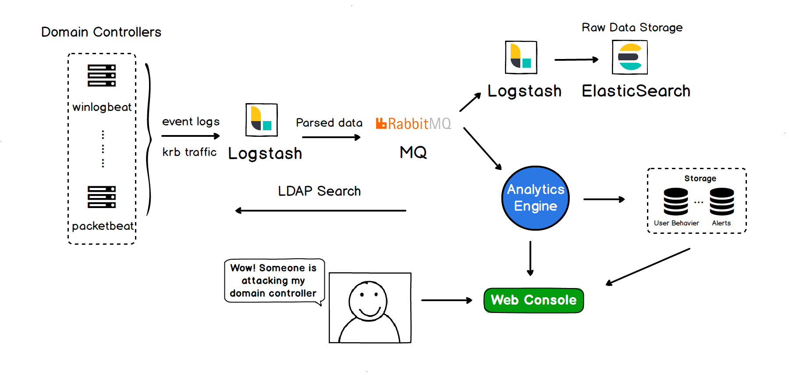

# WatchAD

    

> AD Security Intrusion Detection System

English Document | [中文文档](./README_zh-cn.md)

After Collecting event logs and kerberos traffic on all domain controllers, WatchAD can detect a variety of known or unknown threats through features matching, Kerberos protocol analysis, historical behaviors, sensitive operations, honeypot accounts and so on.The WatchAD rules cover the many common AD attacks.

The WatchAD has been running well on the Qihoo 360 intranet for more than six months and has found several threat activities.

In order to support the open-source community and promote the improvement of the project, we decided to open source part of the system that based on the event log detections.

The following are currently supported detections:
* **Discovery**: Reconnaissance using Directory Services queries, Reconnaissance using PsLoggedOn, Honeypot accounts Activity.
* **Credential Dumping**: Kerberoasting **[NT]**, AS-REP Roasting, Remotely dump the password of DC.
* **Lateral Movement**: Brute Force , Suspicious remotely logon using credentials, Remote execution targeting to DC、Abnormal windows file share name, Encryption downgrade activity **[NT]**, Abnormal Kerberos ticket request **[NT]**.
* **Privilege Escalation**: Abnormal modification of ACL, Detection of MS17-010 attacks, Creation of new Group Policy, NTLM Relay Activity, Sensitive permission of resource-based constraint delegation granted, Attacking printer services with SpoolSample, Privilege escalation with MS14-068 Attacks **[NT]**, Suspicious Kerberos Constraint Delegation activity **[NT]**
* **Persistence**: Modification of AdminSDHolder, DCShadow Attack Detection, Modification of the DSRM password, Sensitive permission of Group Policy delegation granted, Sensitive permission of Kerberos constraint delegated granted, Modification of sensitive groups, Creation of new System Service on DC, Creation of new Scheduled Task on DC, Modification of SIDHistory, Skeleton Key active detection, Skeleton Key passive detection **[NT]**, Kerberos Golden Ticket Activity **[NT]**.
* **Defense Evasion**: Malicous clearance of event logs, Event log service shut down

> **[NT] represent "based on Network traffic"**. Up to now, these part is not in this open-source plan. We will continue to open source based on the feedback.

Our talk "[<u>Evaded Microsoft ATA? **But** You Are Completely Exposed By Event Logs</u>](https://www.blueteamvillage.org/home/dc27/talks#h.p_5uroKErLDdmP)" about detecting AD attacks based on event log is shown at the **DEF CON 27 @ Blue Team Village.**

## Installation

WatchAD is a completely detection system with lots of components. Please refer to [the installation tutorial](https://github.com/0Kee-Team/WatchAD/wiki/install) to install. To set up a honeypot account, please refer to the [honeypot account tutorial](https://github.com/0Kee-Team/WatchAD/wiki/Honeypot-Account)。

**Architecture**：

This project WatchAD only contains part of the code, which associated with the detection engine. In order to format the display you can put alarm data into your platform, or use the Web platform we developed -- [WatchAD-Web](https://github.com/0Kee-Team/WatchAD-Web), which is a simple platform tailored to WatchAD for some common operations. If you have more needs for interface design or operation experience, please customize the development according to WatchAD's alarm data.

## Custom detection module

WatchAD supports the development of custom detection modules, please refer to our [development tutorial](https://github.com/0Kee-Team/WatchAD/wiki/Development)。

If you don't need some module，You can **delete** the module's `.py` file directly and **restart** the detection engine.

**Do not delete** files in the **"record"** directory, which is not involved in threat detections and just record for key activities of entities.

## // TODO

- English code comment
- Compatible with ElasticSearch 6.X
- Reduce false positives
- **Kerberoasting**: the detection based on event log was replaced by kerberos traffic analysis. We are considering add it back.
- **Pass-the-Hash(PtH)**: There are some false positives, optimizing
- **Pass-the-Ticket(PtT)**: There are some false positives, optimizing
- **Silver-Ticket**: There are some false positives, optimizing
- **Fake account information**：There are some false positives, optimizing
- Compromised account detection based on historical behaviors
- Detections Based on Kerberos traffic open source
- NTLM protocol traffic Analysis

If you find other attack methods that can be added to WatchAD detection, please submit a issue to let us know, or submit a PR to become a contributor to this project.

If you find that a detection module has many false positives (more than 10 per day), please submit a issue to tell us or submit a PR after fixing.

## Follow me

Github: [@9ian1i](https://github.com/Qianlitp) Twitter: [@9ian1i](https://twitter.com/9ian1i)

## Reference

* [Active Directory Kill Chain Attack & Defense](https://github.com/infosecn1nja/AD-Attack-Defense)
* [Active Directory Security](https://adsecurity.org/)
* [Windows Security Log Events](https://www.ultimatewindowssecurity.com/securitylog/encyclopedia/default.aspx?i=j)
* [harmj0y's blog](https://blog.harmj0y.net/)
* [event log doc](https://docs.microsoft.com/en-us/windows/security/threat-protection/auditing/event-4624)
* [Understanding SDDL Syntax](https://itconnect.uw.edu/wares/msinf/other-help/understanding-sddl-syntax/)
* [Escalating privileges with ACLs in Active Directory](https://blog.fox-it.com/2018/04/26/escalating-privileges-with-acls-in-active-directory/)
* [Abusing Exchange: One API call away from Domain Admin](https://dirkjanm.io/abusing-exchange-one-api-call-away-from-domain-admin/)
* [3gstudent's blog](https://3gstudent.github.io/3gstudent.github.io/)
* [Penetration Testing Lab Blog](https://pentestlab.blog/)
* [Attack Defense & Detection](https://adsecurity.org/?page_id=4031)
* [INSIDER THREAT SECURITY BLOG](https://blog.stealthbits.com/)
* [How to use the UserAccountControl flags to manipulate user account properties](https://support.microsoft.com/en-us/help/305144/how-to-use-useraccountcontrol-to-manipulate-user-account-properties)
* [Advanced Threat Analytics documentation](https://docs.microsoft.com/en-us/advanced-threat-analytics/)
